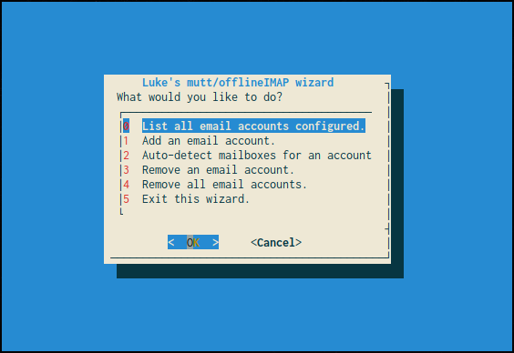

# Luke's mutt Wizard for automatic Neomutt and OfflineIMAP configuration!



Mutt is one of the most rewarding programs one can use, but can be a pain in the ass to configure. Since my job is making power-user tools available for the masses I want to create a tool that automates most of mutt configuration so that users can simply give their email address and get a /comfy/ setup. At that, I don't just want a mutt wizard, but an offlineIMAP wizard, so users can easily access their mail offline as well, and a wizard that makes it easy to store passwords securely using gpg.

The mutt-wizard is all of this in a simple ncurses menu. It's really just a little bash script, but one that can save countless people thousands of combined manhours of frustratingly trying to get all the moving pieces working together.

## User interface

The system takes an email and autodetect its server settings, generating a muttrc and offlineimaprc profile automatically. If it can't do so, it simply prompts you for these (which you can easily look up) and will put them all in the right places. You get:

+ Automatic configuration of mutt and offlineimap.
+ Automatic encryption and safe storage of passwords which are used by mutt and offlineimap when necessary.
+ Multiple account management in mutt: jump from account to account with the `i` prefix in mutt: `i1`: first email account, `i5`: fifth, etc.
+ Easy movement to mail folders in mutt: `gi`: go to inbox, `gs` to sent mail, `ga` to archive, `gS` to spam, `gd` to drafts, etc.
+ Some default controls and colors. This system is going to be integrated into my [public auto-rice script](https://larbs.xyz) so I want it to look pretty and be usable out the box.
+ An optional autosync script that will smartly run offlineimap when connected to the internet at what interval you want and will notify you with a ding when new mail arrives.

### Will it work on my email? (95% yes)

Yes! At this point, the only problems are the unexpected ones. Please try it, and if you do run into problems, email me at [luke@lukesmith.xyz](mailto:luke@lukesmith.xyz)! I've tried the system personally on Gmail, Teknik.io, cock.li and Yandex, while others have tried other providers.

One email provider which I think will *not* work (and will never work) is Proton Mail, but that's only because they require encryption through their web client IIRC.

Note also that Gmail and some providers require you to enable sign-ins from third-party (or as they call it "less secure") applications to be able to load mail with mutt and offlineimap. Be sure to enable that!

## Installation and Dependencies

`dialog`, `neomutt` and `offlineimap` should be installed. You also need to have a GPG public/private key pair for the wizard to automatically store your passwords. The whole repo should be cloned to `~/.config/mutt/`. (If you have a previous mutt folder, you'll want to back it up or delete it first.)

```
git clone https://github.com/LukeSmithxyz/mutt-wizard.git ~/.config/mutt
```

You will want to delete or rename your current `~/.offlineimaprc` as well, as although you can later modify the `~/.offlineimaprc` produced by the script, you must have no file there the first time you add your first account or the wizard will assume some settings are already set which aren't.

Just run `mutt-wizard.sh` and choose to add an account. After you do so, you may run `offlineimap` to begin the mailsync, and you will be able to run neomutt and see your mail.

### Non-essential dependencies

The automatically deployed configs will look for certain programs for certain extra abilities. Consider installing the following for the extra functionality.

+ `urlview` -- Detecting and following links with `ctrl-u`
+ `mupdf` -- for viewing attached pdfs (`v` to view attachments, then select .pdf)
+ `notmuch` -- for mail searching and indexing set to `ctrl-f`. Be sure to run `notmuch setup`. Remember your mail is in `~/.mail/` when you configure notmuch.
+ `w3m` and/or `w3mimg` -- for viewing images. Like .pdfs, view in the attachments menu.
+ A cron manager if you want the autosync feature.
+ `iproute2mac` for Mac users who want the autosync feature.
+ `mpv` if you want the autosync feature to notify you with a ding on new mail.

### "Wait? The script asks for my passwords?"

Look at the code. The script takes the passwords you give it, encrypts them immediately with your own GPG key, and shreds the leftovers. Nothing malicious; it's all there! If it makes you comfortable you can even run the script offline at first.

## You can help!

If you use mutt with a particular host or domain, put your server information in `domains.csv`! This will make everyone else who uses your email provider's life much easier!

Or you can help monetarily via [Patreon](https://patreon.com/lukesmith) or [Paypal](https://paypal.me/LukeMSmith)!

## Notes

Mail is stored in `~/.mail`. mutt configs and caches for each account are in `~/.config/mutt/accounts/`. Encypted passwords are in `~/.config/mutt/credentials`. A "personal" muttrc, with the macros for switching accounts and the default config is in `~/.config/mutt/personal.muttrc`.

## Todo

* Expand the list of server information in `domains.csv`, possibly porting the Thunderbird autoconfigure settings.
